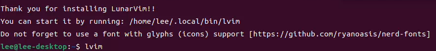

### 前景提要

最近打算把内存8GB的树莓派安装桌面版的Ubuntu做第二生产力，但是没想到内存是够的，打开浏览器，`VScode`,  开几个终端，还能有4GiB多，但CPU真是太拉跨了，即使把CPU和GPU超频后有了较大提升，但发热到62°C，实际体验上鼠标不跟手，打开软件需要好几秒，大有人类科技生产力倒退10年的感觉。

至于我最爱的前端常用IDE------`VSCode`，体验更是惨不忍睹，敲个字母需要半天才能显示。正好平时在 `VSCode`上习惯了vim的使用（今年最好的投资），打算在Linux环境下配置一个轻量且优雅的vim配置环境。看着 `neovim`的各种推荐，打算入坑了。

记录一下安装的过程，万一之后环境崩了也能快速恢复(或许可以尝试docker?有空得学学)

### 一、安装neovim

上来就踩坑了，命令行直接安装 `sudo apt install neovim`，装完发现是0.6.x的版本，重装，输入 `nvim`命令时发现，命令行提示可以使用 `sudo snap install neovim`，安装完发现版本时0.9.x，很好，进入下一步......结果在安装 `lunarvim`时，似乎就因为这个snap版本的 `neovim`出错了......

#### 正确安装方法

因为 `neovim`没有树莓派的arm64架构的包，需要从github上clone源码，然后进入项目的目录使用 `sudo make install`执行编译安装命令（需要提前安装好 `cmake`）。
安装过程中因为缺少一些软件包导致一些报错，参考这篇文章[ubuntu（debian）源码安装neovim - 代码先锋网 (codeleading.com)](https://www.codeleading.com/article/35441029841/)

有时候从会卡在从网络上下载包超时报错，多尝试几次就好

### 二、安装lunarvim

安装 `lunarvim`也是大坑颇多，好在已经熟练掌握了直接从[LunarVim](https://www.lunarvim.org/)查找安装教程的方法论。

先看需要的环境：

- Have [`git`](https://cli.github.com/), [`make`](https://www.gnu.org/software/make/), [`pip`](https://pypi.org/project/pip/), [`python`](https://www.python.org/), [`npm`](https://npmjs.com/), [`node`](https://nodejs.org/) and [`cargo`](https://www.rust-lang.org/tools/install) installed on your system.

一阵安装之后，自信地执行官网上粘贴的安装命令。

安装 `nodejs` 上的依赖，安装python上的依赖，安装rust上的依赖，这里出现了问题，我的 `rustc`版本是1.66， 一个依赖包需要 1.70+版本的 `restc`，想着既然是配置的依赖， 莫非是写rust的才需要配置的？再次执行安装命令， 是否安装选择了n，似乎只是某个安装插件失败了，教程里好像也又这种情况， 切到 `.local\bin`执行 `lvim` ，报错 `unknown -u`, 搜索一番，发现了github上的一个issue [Error while lunarvim installation `unknown flag 'u'` ](https://github.com/LunarVim/LunarVim/issues/3612),尝试了里面的方法， 注释了一条exec语句，不报错了，但是 `lvim` 启动不了， 看到又提示不要使用snap版本的 `nvim` 又重新卸载了snap的 `nvim` , 使用上面讲到的源码安装了一遍。再次安装，`rustc` 的版本依然不符合，那直接升级一下就好了。安装 `rustup`升级一下，执行了好几遍升级命令，提示已经把rust相关的环境升级了， 但是使用 `rustc --version`查询出来仍然是1.66版本，靠着直觉猜测大概又是使用命令行安装的cargo出现了问题。果然，卸载之后，再执行安装就好了。

但是这时候问题又来了，安装命令回车执行之后，会自动结束，而不执行安装命令了，相比是卸载残留的影响，重新打开终端，但依然不行。

想到直接把安装命令下载下来吧

```bash
LV_BRANCH='release-1.3/neovim-0.9' bash <(curl -s https://raw.githubusercontent.com/LunarVim/LunarVim/release-1.3/neovim-0.9/utils/installer/install.sh)
```

访问连接中的网址，复制粘贴到本地新建的install.sh，然后执行

```bash
LV_BRANCH='release-1.3/neovim-0.9' bash ./install.sh
```

终于行了，等待了半天终于等到了振奋人心的安装成功显示， `lvim`启动成功！



折腾了一晚上，后续再更新nvim的配置过程

### 参考链接

* [Linux上配置LunarVim：快速初始化Neovim，让你的文本编辑更加清爽和强大](https://cloud.tencent.com/developer/article/2215919)
* [rust 是否有命令将Cargo更新到最新的官方版本？](https://www.saoniuhuo.com/question/detail-2515840.html)
