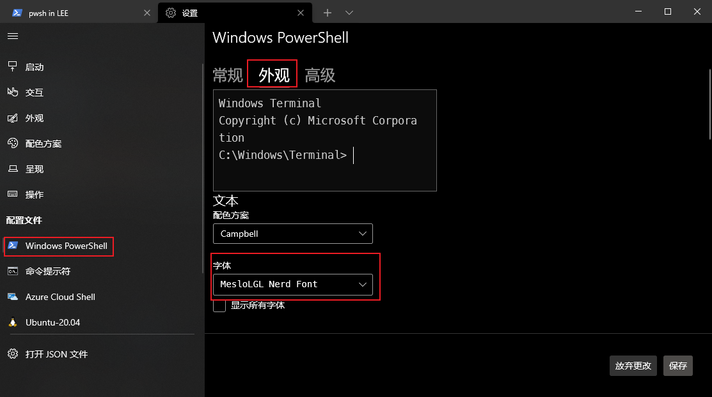

# oh-my-posh 配置--更好看的终端外观

折腾 Windows 上的 PowerShell 无意中看到了 oh-my-posh 的这个终端美化应用，在 VSCode 中的显示效果也是极好的

## 安装

直接在 Microsoft Store 安装 oh-my-posh，然后打开官网安步骤进行操作，步骤主要包括下载字体和字体配置，但是遇到的问题也很多

1. 命令行无法下载字体
   可能是因为网络原因，无法通过`oh-my-posh font install`下载字体，最终发现在 oh-my-posh 官网上点击链接，直接下载字体，然后将压缩包中的所有 ttf 字体文件下载放到 Windows 系统的 Fonts 目录下，系统就会自动安装字体!字体的名称就是官网安装教程中的`MesloLGM Nerd Font`[字体](https://github.com/ryanoasis/nerd-fonts/releases/download/v3.0.2/Meslo.zip)
2. 在 VSCode 中配置字体
   需要在 VSCode 中的`settings.json`中添加字体配置代码`"terminal.integrated.fontFamily": "MesloLGM Nerd Font"`
3. 在 Windows Terminal 中配置字体
   官网上描述的配置 Windows Terminal 的 settings.json 的方法无法生效，需要在 Windows Terminal 中手动指定 PowerShell 的字体
   

## 配置主题

默认的主题，个人感觉太过炸眼，需要修改默认的主题，找个还算简洁的修改一下[shell 主题](https://github.com/JanDeDobbeleer/oh-my-posh/blob/main/themes/1_shell.omp.json)
将修改后的内容添加到`C:\Users\LEE\AppData\Local\Programs\oh-my-posh\themes`目录下，然后在使用`notepad $PROFILE`命令修改 PowerShell 启动时加载的用户配置
`oh-my-posh init pwsh --config "$env:POSH_THEMES_PATH/my-theme.json" | Invoke-Expression`

```json
{
  "$schema": "https://raw.githubusercontent.com/JanDeDobbeleer/oh-my-posh/main/themes/schema.json",
  "blocks": [
    {
      "alignment": "left",
      "newline": true,
      "segments": [
        {
          "foreground": "#ffafd2",
          "properties": {
            "folder_icon": "",
            "folder_separator_icon": "/",
            "home_icon": "home",
            "style": "agnoster_full"
          },
          "style": "diamond",
          "template": "\ue5ff {{ .Path }} ",
          "trailing_diamond": "",
          "type": "path"
        }
      ],
      "type": "prompt"
    },
    {
      "alignment": "left",
      "newline": true,
      "segments": [
        {
          "foreground_templates": ["{{ if gt .Code 0 }}#ef5350{{ end }}"],
          "properties": {
            "always_enabled": true
          },
          "style": "plain",
          "template": "<#00c7fc>\ue285</><#ffafd2></>",
          "type": "status"
        }
      ],
      "type": "prompt"
    }
  ],
  "console_title_template": "{{ .Folder }}",
  "transient_prompt": {
    "background": "transparent",
    "foreground": "#FEF5ED",
    "template": "\ue285 "
  },
  "version": 2
}
```
