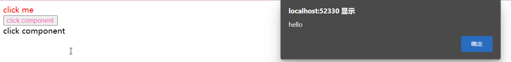

### 前情提要

在看了《Vue.js设计于实现》的第3章的实现思路之后，参考着完成了一个简单的渲染器，能够渲染一般的DOM对象，函数式的组件和对象式的组件渲染， 并能渲染DOM对象上的style样式

渲染器的作用是将虚拟DOM转换为真实的DOM，实现一个渲染器主要有3步：

1. 创建元素
2. 添加属性和事件
3. 处理children

### 基础的渲染器

```js
function mountElement(vnode, container) {
    // 使用vnode.tag创建DOM元素
    const el = document.createElement(vnode.tag)
    // 遍历vnode.props, 将属性, 事件添加到DOM元素
    for (const key in vnode.props) {
        if (/^on/.test(key)) {
            el.addEventListener(
                key.substr(2).toLowerCase(),
                vnode.props[key]
            )
        } else if (key === 'style') {
            el.style = vnode.props[key]
        }
    }
    // 处理children
    if (typeof vnode.children === 'string') {
        el.appendChild(document.createTextNode(vnode.children))
    } else if (Array.isArray(vnode.children)) {
        // 递归调用renderer渲染子节点
        vnode.children.forEach(child => renderer(child, el))
    }
    // 将元素添加到挂载点下
    container.appendChild(el)
}
```

### 渲染函数式和对象式组件

主要是根据组件的不同类型来获取对应的虚拟DOM对象，然后调用渲染函数

```js
// 渲染函数式组件
function mountFuncComponent(vnode, container){
    const subTree = vnode.tag()
    renderer(subTree, container)
}

// 渲染对象式组件
function mountObjComponent(vnode, container){
    const subTree = vnode.tag.render()
    renderer(subTree, container)
}
```

### 渲染函数renderer

```js
function renderer(vnode, container) {
    // 渲染一般DOM
    if(typeof vnode.tag === 'string'){
        mountElement(vnode, container)
    }else if(typeof vnode.tag ==='function'){ // 渲染使用函数定义的组件
        mountFuncComponent(vnode, container)
    }else if(typeof vnode.tag === 'object'){ // 渲染对象时的组件
        mountObjComponent(vnode, container)
    }
}
```

### 测试

```js
// 一般DOM对象声明
const vnode = {
    tag: 'div',
    props: {
        onClick: () => alert('hello'),
        style:"color:red"
    },
    children: 'click me'
}

// 函数式组件声明
const FuncComponent = function(){
 return {
    tag: 'div',
    props:{
        onClick: ()=>alert('click component'),
        style: 'color:hotpink'
    },
    children: 'click component'
 }   
}

// 对象式组件声明
const ObjectComponent = {
    render(){
        return {
            tag: 'div',
            props:{
                onClick: ()=>alert('click component')
            },
            children: 'click component'
         }
    }
} 

const FucnComponentNode = {
    tag: FuncComponent
}

const ObjComponentNode = {
    tag: ObjectComponent
}

renderer(vnode, document.body)

renderer(FucnComponentNode, document.body)

renderer(ObjComponentNode, document.body)
```

#### 测试结果



渲染器成功把虚拟DOM元素渲染到了页面上，并且能触发事件。

