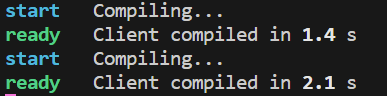
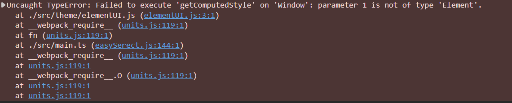

# 7700+modules项目迁移到Rsbuild

在学习了Webpack之后，了解到了字节开源的使用Rust编写的Rsbuild前端构建工具，便把手头的一个总共含有7700多个模块的Vue Cli构建的项目，迁移到Rsbuild，测试实际效果，浅浅尝试一番

## 使用Vue Cli构建的时间

在没有迁移之前，使用的是Vue Cli, 构建的使用花费大概需要一分多钟，每次开发都感觉项目启动十分耗时

## 使用Rsbuild构建的时间

将项目从Vue Cli迁移到Rsbuild在Rsbuild的官方文档里已经详细说明，参考[Vue CLI - Rsbuild](https://rsbuild.dev/zh/guide/migration/vue-cli)，主要是修改配置文件中的模板和跨域

**项目的编译和启动时间有了大幅的缩短，总共只需十几秒就完成了编译**



### 遇到的问题

1. 编码格式错误

项目Compling时， 提示

```txt
start   Compiling...
error   Compile error: 
Failed to compile, check the errors for troubleshooting.
File: ./src/API/homePageQuery.js
  × Module build failed:
  ╰─▶   × invalid utf-8 sequence of 1 bytes from index 46

  help: File was processed with this loader: 'builtin:swc-loader??clonedRuleSet-2.use[0]'
```

打开这个文件发现，里面的注释乱码了，所以应该是一些同学使用错误的编码格式导致的，在VS Code中修改使用utf-8重新保存，替换了乱码的注释，最后项目正常编译

2. getComputedStyle无法执行

打开浏览器时，项目无法运行，控制台报错如下



查看对应的源代码时，发现好像对应的`getComputedStyle`代码s似乎并没有实际的用处

```js
//修改 elementPlus 全局主题
const el = document.getElementById('app');
getComputedStyle(el).getPropertyValue(`--el-color-primary`);
el.style.setProperty('--el-color-primary', 'rgb(24,56,140)');
```

经过测试，虽然删除这一修改主题的代码，但是获取的el是null，也就是没有获取到vue项目中的重新查看文档，原来是忘了指定HTML模板，以为Rsbuild使用的是默认的 `public/index.html`，实际上在Rsbuild中需要显式配置！！如果HTML模板中使用到了 `BASE_URL`变量，则会报错，按照官网上的方法替换为assetPrefix并在路径上添加斜线，但是类似 `<%= htmlWebpackPlugin.options.title %>`这样的引用确实能直接使用，不需要修改的。

```typescript
export default defineConfig({
  // 指定模板文件
  html: {
    template: './public/index.html',
  },
});
```

